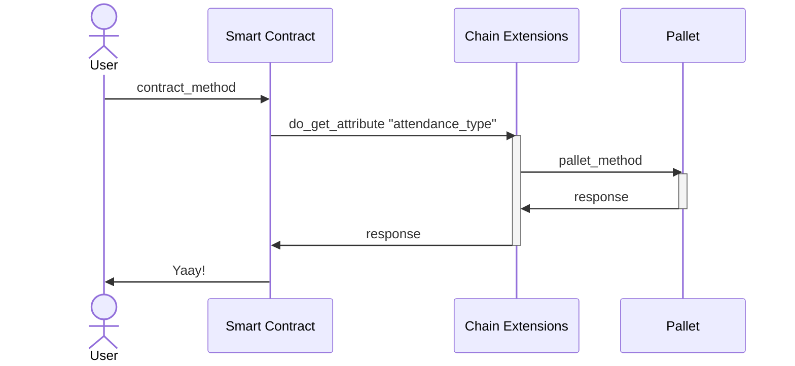
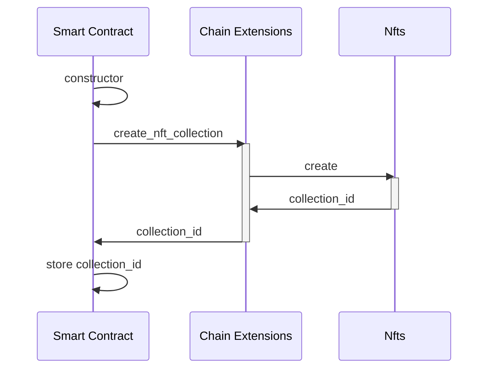
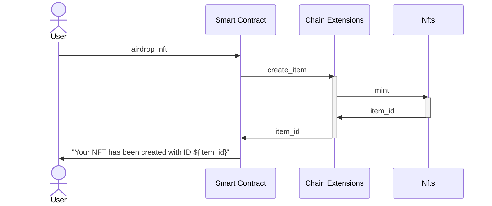

# Unlocking Parachain Potential: Integrating ink! Smart Contracts with Chain Extensions

---

## What do you need?

<pba-flex center>

- `cargo-contract`
- `zombienet`
- Want to have fun!

</pba-flex>

---v

### `cargo-contract`

<https://use.ink/getting-started/setup/>

---v

### `zombienet`

<https://paritytech.github.io/zombienet/install.html#using-npm>

---

## Chain Extensions

<!-- .element: style="width: 50%" -->

---v

### It's all about passing messages

---

## What can YOU do with Chain Extensions?

Depends… who are you?

---v

### As a Runtime Developer

Design an API that allows contract developers to extend what your users can do on your blockchain.

---v

### As a Contract Developer

Interact with the blockchain via a more specialized _"API"_.

---v

### Today we are both

---v

---

## What we're doing today?

---v

---v

---v

### Let's get to the code

<https://github.com/pandres95/ink-chain-extensions-demo>
